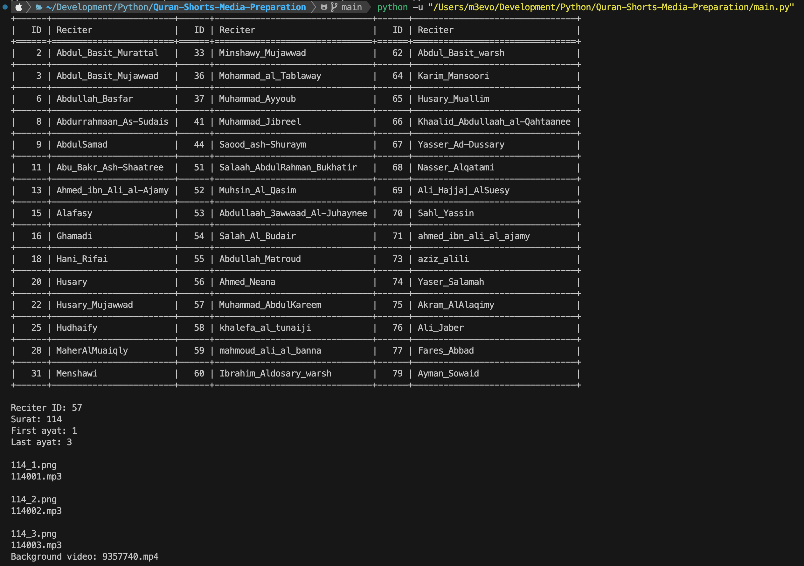
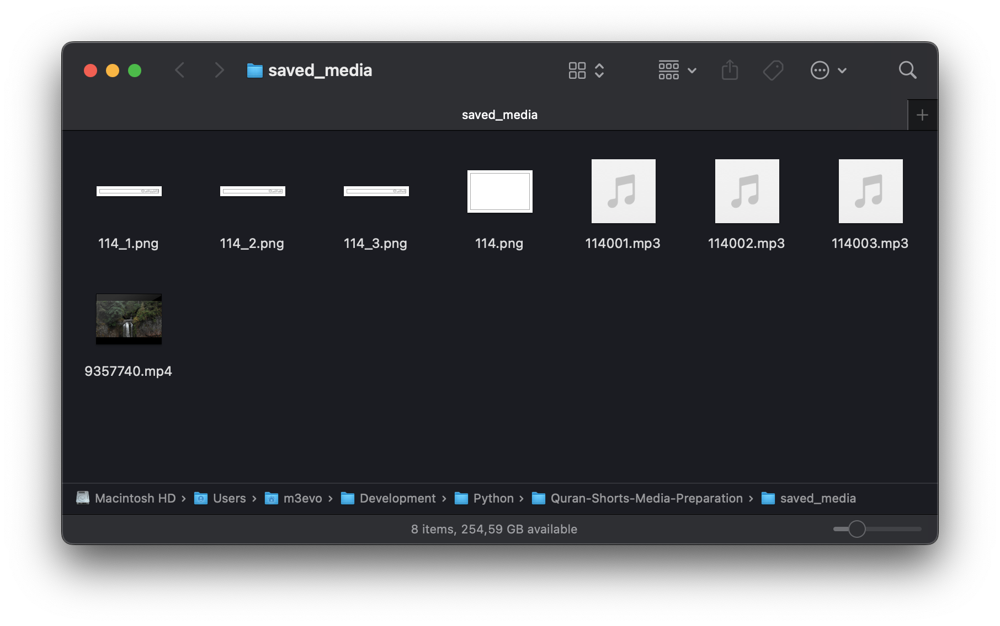

# Quran-Shorts-Media-Preparation

This repository showcases my workflow to automate the preparation of media files for my Quran shorts on <https://www.youtube.com/@islamic-vibes-33/shorts>

## 1. Install Dependencies

You can install the required Python 3.x libraries using pip:

```sh
pip install requests Pillow python-dotenv tabulate
```

## 2. Prepare Pexels API key

Pexels is a platform that contains free high quality images and videos shared by creators.

- Create an account on <https://www.pexels.com/join-consumer/>
- Request an API key from <https://www.pexels.com/api/new/> and use it in your code
- Make sure to set the download directory to your desired location

Read [Pexels' API documentaion](https://www.pexels.com/api/documentation/) if needed.

## 3. Run `main.py`

Make sure the working folder is set to `Quran-Shorts-Media-Preparation` unless renamed, because the script uses relative paths.




